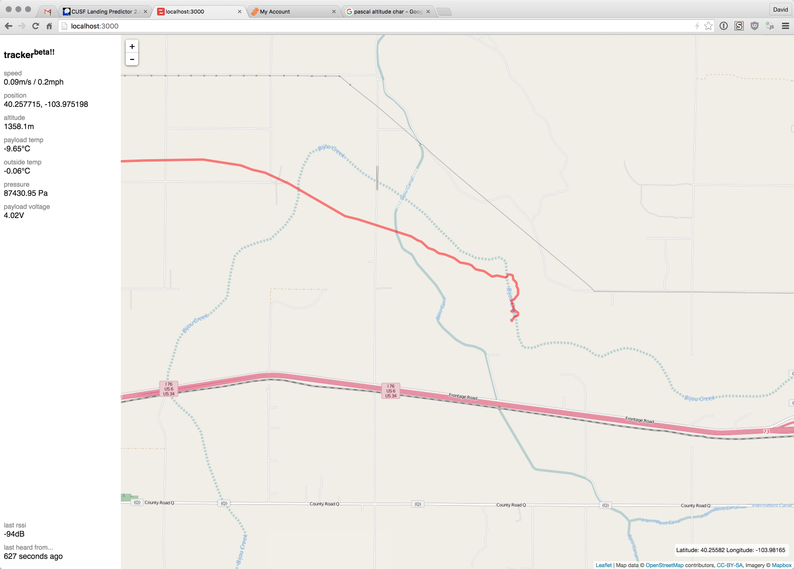

# baltrak - a weather balloon tracker

The great folks in `#highaltitude` on freenode have developed the [habhub tracker](http://tracker.habhub.org/), which is an amazing piece of software for tracking weather balloons all over the world.

It doesn't quite fit my needs as I am often in a chase car many miles from the nearest available wireless service, and still need to track a balloon. Enter baltrak, a bit of go and javascript that I wrote in a frenzy to enable just that.

This software can run 100% offline with zero dependencies, does basic map tile caching, and can use pregenerated map tiles. It contains a go service that listen to a serial port for strucutred data, and spews it over a websocket to a browser pointed at localhost.

Don't rely on this to work. For any reason.

